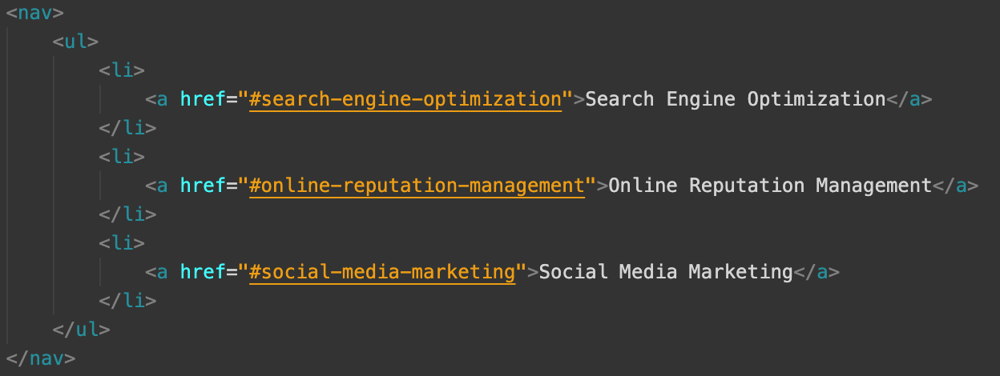
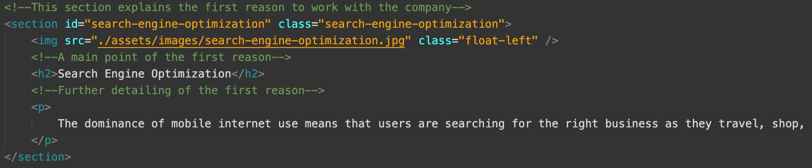

# Code-Refactor

Code-Refactor is a project that takes the company Horiseon's website and examines its source code and converts the generic tags into semantic html tags, maintains and improves upon the logical structure of the html file, and fixes parts of the website that were not functioning as expected.

## Installation

To view the website locally, first go into the folder called "Code-Refactor" that contains all the related files of the site, and make sure that the index.html is at the root of the folder "Code-Refactor", and that the "assets" folder at the root contains the folders named "css" and "images". The "css" folder contains the external css file called "style.css" that is used to style the tags inside the index.html file to produce the desired look of the site. The "images" folder contains 7 images that are needed by the site. After checking all the files to be in place, simply go back to the root directory and double clicked on the index.html to view the website.

To view the published site through a browser, simply click on this link "https://hugh18019.github.io/Code-Refactor/".

## Technology Used

The index.html file of the project uses semantic html tages to replace previous html tags that were generic without meanings.
The style.css uses css to select tags used by the index.html file to apply styles and manipulations to them to achieve the required look of the website.

## Main Features

The main feature of the website is the provided navigatation bar at the top of the site. Each button in the navigation bar once clicked can jump to different sections of the site to provide the user with more information that.

Here is a few screenshots of this feature:

Format: 

Format: 

Other features of the website contain embedded images that help in the delivery of the company's objectives and strengths.
